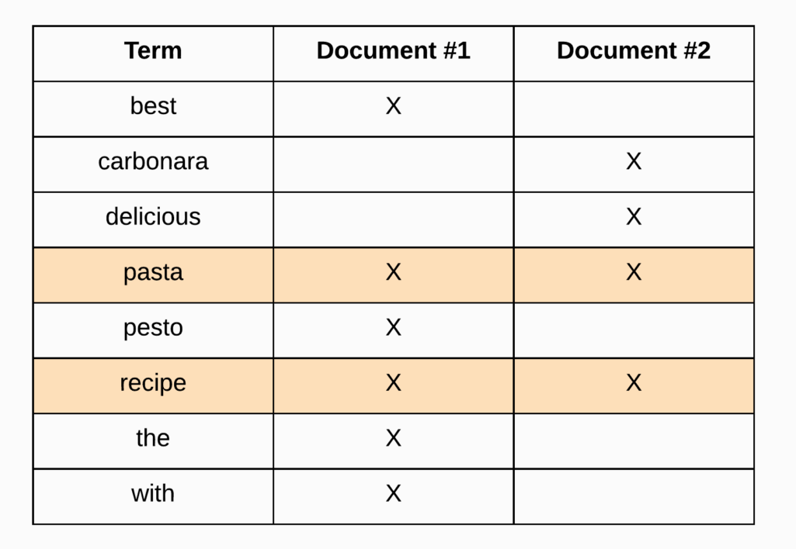

To create an index:

curl -X PUT "localhost:9200/twitter?pretty" -H 'Content-Type: application/json' -d'
{
    "settings" : {
        "index" : {
            "number_of_shards" : 3, 
            "number_of_replicas" : 2 
        }
    }
}

curl -X DELETE "localhost:9200/twitter?pretty"

curl -X PUT "localhost:9200/twitter?pretty"

By default 5 shards and 1 replica 

curl localhost:9200/_cat/health?v&pretty

for health check up

Elastic search uses rest architecture.

Data in: documents and indices

#### Inverted Indexing working process

  - Refer: https://www.elastic.co/guide/en/elasticsearch/reference/current/documents-indices.html

    * Elasticsearch is a distributed document store. Instead of storing information as rows of columnar data, Elasticsearch stores complex data structures that have been serialized as JSON documents. When you have multiple Elasticsearch nodes in a cluster, stored documents are distributed across the cluster and can be accessed immediately from any node.

    * When a document is stored, it is indexed and fully searchable in near real-time—​within 1 second. Elasticsearch uses a data structure called an inverted index that supports very fast full-text searches. An inverted index lists every unique word that appears in any document and identifies all of the documents each word occurs in.

    *   An index can be thought of as an optimized collection of documents and each document is a collection of fields, which are the key-value pairs that contain your data. By default, Elasticsearch indexes all data in every field and each indexed field has a dedicated, optimized data structure. For example, text fields are stored in inverted indices, and numeric and geo fields are stored in BKD trees. The ability to use the per-field data structures to assemble and return search results is what makes Elasticsearch so fast.
    * Elasticsearch also has the ability to be schema-less, which means that documents can be indexed without explicitly specifying how to handle each of the different fields that might occur in a document. When dynamic mapping is enabled, Elasticsearch automatically detects and adds new fields to the index. This default behavior makes it easy to index and explore your data—​just start indexing documents and Elasticsearch will detect and map booleans, floating point and integer values, dates, and strings to the appropriate Elasticsearch datatypes.

    * The purpose of an inverted index, is to store text in a structure that allows for very efficient and fast full-text searches. When performing full-text searches, we are actually querying an inverted index and not the JSON documents that we defined when indexing the documents. The reason why I say an inverted index, is because a cluster will have at least one inverted index. That’s because there will be an inverted index for each full-text field per index. So if you have an index containing documents that contain five full-text fields, you will have five inverted indices.

    * An inverted index consists of all of the unique terms that appear in any document covered by the index. For each term, the list of documents in which the term appears, is stored. So essentially an inverted index is a mapping between terms and which documents contain those terms. Since an inverted index works at the document field level and stores the terms for a given field, it doesn’t need to deal with different fields. So what you will see in the following example is at the scope of a specific field.

    * Highlevel elastic index
    
      
    * We can compare an inverted index to an old library catalog card system. When you need some information/book in a library, you will use the card catalog, usually at the entrance of the library, to find the book. An inverted index is similar to the card catalog. Imagine that you were to build a system like Google to search for the web pages mentioning your search keywords. We have three web pages with Yoda quotes from Star Wars, and you are searching for all the documents with the word fear.
        * Document1: Fear leads to anger
        * Document2: Anger leads to hate
        * Document3: Hate leads to suffering
    * In a library, without a card catalog to find the book you need, you would have to go to every shelf row by row, look at each book title, and see whether it’s the book you need. Computer-based information retrieval systems do the same.

        - Without the inverted index, the application has to go through each web page and check whether the word exists in the web page. An inverted index is similar to the following table. It is like a map with the term as a key and list of the documents the term appears in as value.
            -   Term 	       Document
            -   Fear 	       1
            -   Anger 	       1,2
            -   Hate 	       2,3
            -   Suffering      3
            -   Leads 	       1,2,3
        - Once we construct an index, as shown in this table, to find all the documents with the term fear is now just a lookup. Just like when a library gets a new book, the book is added to the card catalog, we keep building an inverted index as we encounter a new web page. The preceding inverted index takes care of simple use cases, such as searching for the single term.
        
        * In reality, we query for much more complicated things, and we don’t use the exact words. Now let’s say we encountered a document containing the following:
    
            - Document : Yosemite national park may be closed for the weekend due to forecast of substantial rainfall
            - We want to visit Yosemite National Park, and we are looking for the weather forecast in the park. But when we query for it in the human language, we might query something like weather in yosemite or rain in yosemite. With the current approach, we will not be able to answer this query as there are no common terms between the query and the document, as shown:
                Document 	Query
                rainfall 	rain
            - Stemming is the process of reducing a derived word into its root word. For example, rain, raining, rained, rainfall has the common root word “rain”. When a document is indexed, the root word is stored in the index instead of the actual word. Without stemming, we end up storing rain, raining, rained in the index, and search relevance would be very low. The query terms also go through the stemming process, and the root words are looked up in the index. Stemming increases the likelihood of the user finding what he is looking for. When we query for rain in yosemite, even though the document originally had rainfall, the inverted index will contain term rain. We can configure stemming in Elasticsearch using Analyzers.
                
            - Synonyms
                
                Similar to rain and raining, weekend and sunday mean the same thing. The document might not contain Sunday, but if the information retrieval system can also search for synonyms, it will significantly improve the search quality. Human language deals with a lot of things, such as tense, gender, numbers. Stemming and synonyms will not only improve the search quality but also reduce the index size by removing the differences between similar words.
                
                More examples:
                
                Pen, Pen[s] -> Pen
                
                Eat, Eating  -> Eat
             - Phrase search
                
                As a user, we almost always search for phrases rather than single words. The inverted index in the previous section would work great for individual terms but not for phrases. Continuing the previous example, if we want to query all the documents with a phrase anger leads to in the inverted index, the previous index would not be sufficient. The inverted index for terms anger and leads is shown below:
                Term 	Document
                Anger 	1,2
                Leads 	1,2,3
                               
                From the preceding table, the words anger and leads exist both in document1 and document2. To support phrase search along with the document, we also need to record the position of the word in the document. The inverted index with word position is shown here:
                Term 	    Document
                Fear 	    1:1
                Anger 	    1:3, 2:1
                Hate 	    2:3, 3:1
                Suffering 	3:3
                Leads 	    1:2, 2:2, 3:2
                
                Now, since we have the information regarding the position of the word, we can search if a document has the terms in the same order as the query.
                Term 	Document
                anger 	1:3, 2:1
                leads 	1:2, 2:2
                
                Since document2 has anger as the first word and leads as the second word, the same order as the query, document2 would be a better match than document1. With the inverted index, any query on the documents is just a simple lookup. This is just an introduction to inverted index; in real life, it’s much more complicated, but the fundamentals remain the same. When the documents are indexed into Elasticsearch, documents are processed into the inverted index.

#### How lucene search works

 - Lucene is an inverted full-text index. This means that it takes all the documents, splits them into words, and then builds an index for each word. Since the index is an exact string-match, unordered, it can be extremely fast. Hypothetically, an SQL unordered index on a varchar field could be just as fast, and in fact I think you'll find the big databases can do a simple string-equality query very quickly in that case.
    Lucene does not have to optimize for transaction processing. When you add a document, it need not ensure that queries see it instantly. And it need not optimize for updates to existing documents.However, at the end of the day, if you really want to know, you need to read the source. Both things you reference are open source, after all.
 - Refer http://infolab.stanford.edu/~backrub/google.html    
 - Refer https://www.quora.com/What-is-an-intuitive-description-of-how-Lucene-works
 - Refer https://hub.packtpub.com/how-does-elasticsearch-work-tutorial/
   
   * You want to build a search engine. The world consists of several documents containing words. When entering a textual query (several keywords) we would like to get a sorted list of documents in return - the ones that are most relevant to the query.
    
        * Let's look at a sample corpus of five documents:
    
            My sister is coming for the holidays.
            The holidays are a chance for family meeting.
            Whom did your sister meet?
            It takes an hour to make fudge.
            My sister makes awesome fudge.
        
        * What does Lucene do? Lucene is a full text search library.
            Search has two principal stages: indexing and retrieval.
        * During indexing, each document is broken into words, and the list of documents containing each word is stored in a list called the "postings list".
            * The posting list for the word "My" is:
                * My --> 1,5
            * And the posting list for the word "fudge" is:
                * fudge --> 4,5
            * The index consists of all the posting lists for the words in the corpus.
            * Indexing must be done before retrieval, and we can only retrieve documents that were indexed.
        
        * Retrieval is the process starting with a query and ending with a ranked list of documents. Say the query is [my fudge]. (The brackets denote the borders of the query). In order to find matches for the query, we break it into the individual words, and go to the posting lists. The full list of documents containing the keywords is [1,4,5]. Because document 5 contains both words and documents 1 and 4 contain just a single word from the query, a possible ranking is: 5, 1, 4 (document 5 appears first, then document 4, then document 1).
        * In general, indexing is a batch, preprocessing stage, and retrieval is a quick online stage, but there are exceptions.
    
        * This is the gist of Lucene. The rest of Lucene is (many important) specific bells and whistles for the indexing and retrieval processes.