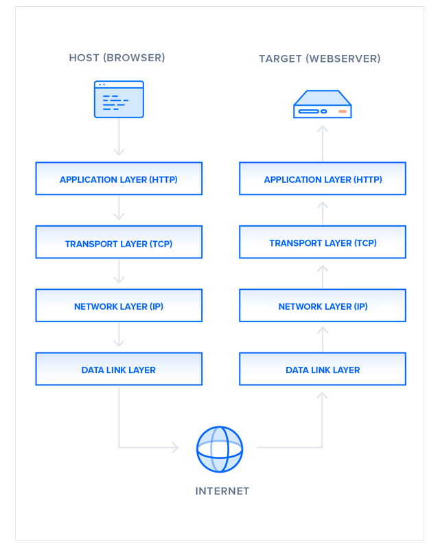
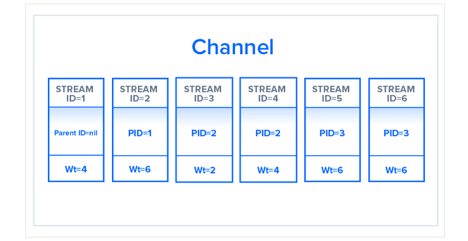
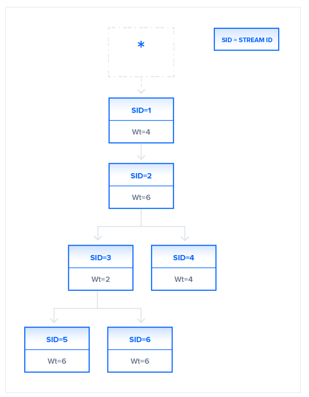
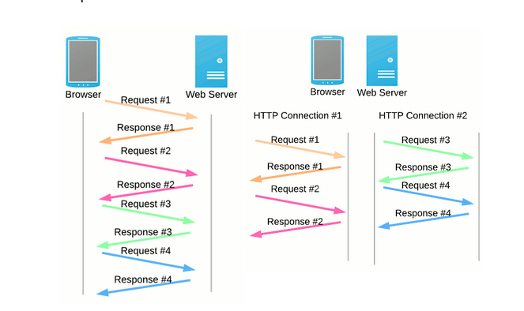

HTTP is a protocol which allows the fetching of resources, such as HTML documents. It is the foundation of any data exchange on the Web and it is a client-server protocol, which means requests are initiated by the recipient, usually the Web browser. A complete document is reconstructed from the different sub-documents fetched, for instance text, layout description, images, videos, scripts, and more.

A Web document is the composition of different resources

Clients and servers communicate by exchanging individual messages (as opposed to a stream of data). The messages sent by the client, usually a Web browser, are called requests and the messages sent by the server as an answer are called responses.

HTTP as an application layer protocol, on top of TCP (transport layer) and IP (network layer) and below the presentation layer.Designed in the early 1990s, HTTP is an extensible protocol which has evolved over time. It is an application layer protocol that is sent over TCP, or over a TLS-encrypted TCP connection, though any reliable transport protocol could theoretically be used. Due to its extensibility, it is used to not only fetch hypertext documents, but also images and videos or to post content to servers, like with HTML form results. HTTP can also be used to fetch parts of documents to update Web pages on demand.
Components of HTTP-based systems

HTTP is a client-server protocol: requests are sent by one entity, the user-agent (or a proxy on behalf of it). Most of the time the user-agent is a Web browser, but it can be anything, for example a robot that crawls the Web to populate and maintain a search engine index.

Each individual request is sent to a server, which handles it and provides an answer, called the response. Between the client and the server there are numerous entities, collectively called proxies, which perform different operations and act as gateways or caches, for example.

Client server chain

In reality, there are more computers between a browser and the server handling the request: there are routers, modems, and more. Thanks to the layered design of the Web, these are hidden in the network and transport layers. HTTP is on top, at the application layer. Although important to diagnose network problems, the underlying layers are mostly irrelevant to the description of HTTP.
Client: the user-agent

The user-agent is any tool that acts on the behalf of the user. This role is primarily performed by the Web browser; other possibilities are programs used by engineers and Web developers to debug their applications.

The browser is always the entity initiating the request. It is never the server (though some mechanisms have been added over the years to simulate server-initiated messages).

To present a Web page, the browser sends an original request to fetch the HTML document that represents the page. It then parses this file, making additional requests corresponding to execution scripts, layout information (CSS) to display, and sub-resources contained within the page (usually images and videos). The Web browser then mixes these resources to present to the user a complete document, the Web page. Scripts executed by the browser can fetch more resources in later phases and the browser updates the Web page accordingly.

A Web page is a hypertext document. This means some parts of displayed text are links which can be activated (usually by a click of the mouse) to fetch a new Web page, allowing the user to direct their user-agent and navigate through the Web. The browser translates these directions in HTTP requests, and further interprets the HTTP responses to present the user with a clear response.
The Web server

On the opposite side of the communication channel, is the server, which serves the document as requested by the client. A server appears as only a single machine virtually: this is because it may actually be a collection of servers, sharing the load (load balancing) or a complex piece of software interrogating other computers (like cache, a DB server, or e-commerce servers), totally or partially generating the document on demand.

A server is not necessarily a single machine, but several server software instances can be hosted on the same machine. With HTTP/1.1 and the Host header, they may even share the same IP address.
Proxies

Between the Web browser and the server, numerous computers and machines relay the HTTP messages. Due to the layered structure of the Web stack, most of these operate at the transport, network or physical levels, becoming transparent at the HTTP layer and potentially making a significant impact on performance. Those operating at the application layers are generally called proxies. These can be transparent, forwarding on the requests they receive without altering them in any way, or non-transparent, in which case they will change the request in some way before passing it along to the server. Proxies may perform numerous functions:

    caching (the cache can be public or private, like the browser cache)
    filtering (like an antivirus scan or parental controls)
    load balancing (to allow multiple servers to serve the different requests)
    authentication (to control access to different resources)
    logging (allowing the storage of historical information)

### Basic aspects of HTTP 

HTTP is simple

HTTP is generally designed to be simple and human readable, even with the added complexity introduced in HTTP/2 by encapsulating HTTP messages into frames. HTTP messages can be read and understood by humans, providing easier testing for developers, and reduced complexity for newcomers.
HTTP is extensible

Introduced in HTTP/1.0, HTTP headers make this protocol easy to extend and experiment with. New functionality can even be introduced by a simple agreement between a client and a server about a new header's semantics.
HTTP is stateless, but not sessionless

HTTP is stateless: there is no link between two requests being successively carried out on the same connection. This immediately has the prospect of being problematic for users attempting to interact with certain pages coherently, for example, using e-commerce shopping baskets. But while the core of HTTP itself is stateless, HTTP cookies allow the use of stateful sessions. Using header extensibility, HTTP Cookies are added to the workflow, allowing session creation on each HTTP request to share the same context, or the same state.
HTTP and connections

A connection is controlled at the transport layer, and therefore fundamentally out of scope for HTTP. Though HTTP doesn't require the underlying transport protocol to be connection-based; only requiring it to be reliable, or not lose messages (so at minimum presenting an error). Among the two most common transport protocols on the Internet, TCP is reliable and UDP isn't. HTTP therefore relies on the TCP standard, which is connection-based.

Before a client and server can exchange an HTTP request/response pair, they must establish a TCP connection, a process which requires several round-trips. The default behavior of HTTP/1.0 is to open a separate TCP connection for each HTTP request/response pair. This is less efficient than sharing a single TCP connection when multiple requests are sent in close succession.

In order to mitigate this flaw, HTTP/1.1 introduced pipelining (which proved difficult to implement) and persistent connections: the underlying TCP connection can be partially controlled using the Connection header. HTTP/2 went a step further by multiplexing messages over a single connection, helping keep the connection warm and more efficient.

Experiments are in progress to design a better transport protocol more suited to HTTP. For example, Google is experimenting with QUIC which builds on UDP to provide a more reliable and efficient transport protocol.
What can be controlled by HTTP

This extensible nature of HTTP has, over time, allowed for more control and functionality of the Web. Cache or authentication methods were functions handled early in HTTP history. The ability to relax the origin constraint, by contrast, has only been added in the 2010s.

Here is a list of common features controllable with HTTP.

    Caching
    How documents are cached can be controlled by HTTP. The server can instruct proxies and clients, about what to cache and for how long. The client can instruct intermediate cache proxies to ignore the stored document.
    Relaxing the origin constraint
    To prevent snooping and other privacy invasions, Web browsers enforce strict separation between Web sites. Only pages from the same origin can access all the information of a Web page. Though such constraint is a burden to the server, HTTP headers can relax this strict separation on the server side, allowing a document to become a patchwork of information sourced from different domains; there could even be security-related reasons to do so.
    Authentication
    Some pages may be protected so that only specific users can access them. Basic authentication may be provided by HTTP, either using the WWW-Authenticate and similar headers, or by setting a specific session using HTTP cookies.
    Proxy and tunneling
    Servers or clients are often located on intranets and hide their true IP address from other computers. HTTP requests then go through proxies to cross this network barrier. Not all proxies are HTTP proxies. The SOCKS protocol, for example, operates at a lower level. Other protocols, like ftp, can be handled by these proxies.
    Sessions
    Using HTTP cookies allows you to link requests with the state of the server. This creates sessions, despite basic HTTP being a state-less protocol. This is useful not only for e-commerce shopping baskets, but also for any site allowing user configuration of the output.

HTTP flow

When a client wants to communicate with a server, either the final server or an intermediate proxy, it performs the following steps:

    Open a TCP connection: The TCP connection is used to send a request, or several, and receive an answer. The client may open a new connection, reuse an existing connection, or open several TCP connections to the servers.
    Send an HTTP message: HTTP messages (before HTTP/2) are human-readable. With HTTP/2, these simple messages are encapsulated in frames, making them impossible to read directly, but the principle remains the same. For example:

    GET / HTTP/1.1
    Host: developer.mozilla.org
    Accept-Language: fr

Read the response sent by the server, such as:

HTTP/1.1 200 OK
Date: Sat, 09 Oct 2010 14:28:02 GMT
Server: Apache
Last-Modified: Tue, 01 Dec 2009 20:18:22 GMT
ETag: "51142bc1-7449-479b075b2891b"
Accept-Ranges: bytes
Content-Length: 29769
Content-Type: text/html

If HTTP pipelining is activated, several requests can be sent without waiting for the first response to be fully received. HTTP pipelining has proven difficult to implement in existing networks, where old pieces of software coexist with modern versions. HTTP pipelining has been superseded in HTTP/2 with more robust multiplexing requests within a frame.
HTTP Messages

HTTP messages, as defined in HTTP/1.1 and earlier, are human-readable. In HTTP/2, these messages are embedded into a binary structure, a frame, allowing optimizations like compression of headers and multiplexing. Even if only part of the original HTTP message is sent in this version of HTTP, the semantics of each message is unchanged and the client reconstitutes (virtually) the original HTTP/1.1 request. It is therefore useful to comprehend HTTP/2 messages in the HTTP/1.1 format.

There are two types of HTTP messages, requests and responses, each with its own format.
Requests

An example HTTP request:

A basic HTTP request

Requests consists of the following elements:

    An HTTP method, usually a verb like GET, POST or a noun like OPTIONS or HEAD that defines the operation the client wants to perform. Typically, a client wants to fetch a resource (using GET) or post the value of an HTML form (using POST), though more operations may be needed in other cases.
    The path of the resource to fetch; the URL of the resource stripped from elements that are obvious from the context, for example without the protocol (http://), the domain (here, developer.mozilla.org), or the TCP port (here, 80).
    The version of the HTTP protocol.
    Optional headers that convey additional information for the servers.
    Or a body, for some methods like POST, similar to those in responses, which contain the resource sent.

Responses

An example response:

Responses consist of the following elements:

    The version of the HTTP protocol they follow.
    A status code, indicating if the request was successful, or not, and why.
    A status message, a non-authoritative short description of the status code.
    HTTP headers, like those for requests.
    Optionally, a body containing the fetched resource.

APIs based on HTTP

The most commonly used API based on HTTP is the XMLHttpRequest API, which can be used to exchange data between a user agent and a server. The modern Fetch API provides the same features with a more powerful and flexible feature set.

Another API, server-sent events, is a one-way service that allows a server to send events to the client, using HTTP as a transport mechanism. Using the EventSource interface, the client opens a connection and establishes event handlers. The client browser automatically converts the messages that arrive on the HTTP stream into appropriate Event objects, delivering them to the event handlers that have been registered for the events' type if known, or to the onmessage event handler if no type-specific event handler was established.
Conclusion

HTTP is an extensible protocol that is easy to use. The client-server structure, combined with the ability to simply add headers, allows HTTP to advance along with the extended capabilities of the Web.

Though HTTP/2 adds some complexity, by embedding HTTP messages in frames to improve performance, the basic structure of messages has stayed the same since HTTP/1.0. Session flow remains simple, allowing it to be investigated, and debugged with a simple HTTP message monitor.

Source: https://developer.mozilla.org/en-US/docs/Web/HTTP/Overview

--------------------------------------------------------------------------------------------------------------------------

HTTP/1.1

   * Developed by Timothy Berners-Lee in 1989 as a communication standard for the World Wide Web, HTTP is a top-level application protocol that exchanges information between a client computer and a local or remote web server. In this process, a client sends a text-based request to a server by calling a method like GET or POST. In response, the server sends a resource like an HTML page back to the client.

     -   For example, let’s say you are visiting a website at the domain www.example.com. When you navigate to this URL, the web browser on your computer sends an HTTP request in the form of a text-based message, similar to the one shown here:

        GET /index.html HTTP/1.1
        Host: www.example.com

        This request uses the GET method, which asks for data from the host server listed after Host:. In response to this request, the example.com web server returns an HTML page to the requesting client, in addition to any images, stylesheets, or other resources called for in the HTML. Note that not all of the resources are returned to the client in the first call for data. The requests and responses will go back and forth between the server and client until the web browser has received all the resources necessary to render the contents of the HTML page on your screen.

        You can think of this exchange of requests and responses as a single application layer of the internet protocol stack, sitting on top of the transfer layer (usually using the Transmission Control Protocol, or TCP) and networking layers (using the Internet Protocol, or IP): 

* 

There is much to discuss about the lower levels of this stack, but in order to gain a high-level understanding of HTTP/2, you only need to know this abstracted layer model and where HTTP figures into it.

With this basic overview of HTTP/1.1 out of the way, we can now move on to recounting the early development of HTTP/2.
HTTP/2

HTTP/2 began as the SPDY protocol, developed primarily at Google with the intention of reducing web page load latency by using techniques such as compression, multiplexing, and prioritization. This protocol served as a template for HTTP/2 when the Hypertext Transfer Protocol working group httpbis of the IETF (Internet Engineering Task Force) put the standard together, culminating in the publication of HTTP/2 in May 2015. From the beginning, many browsers supported this standardization effort, including Chrome, Opera, Internet Explorer, and Safari. Due in part to this browser support, there has been a significant adoption rate of the protocol since 2015, with especially high rates among new sites.

From a technical point of view, one of the most significant features that distinguishes HTTP/1.1 and HTTP/2 is the binary framing layer, which can be thought of as a part of the application layer in the internet protocol stack. As opposed to HTTP/1.1, which keeps all requests and responses in plain text format, HTTP/2 uses the binary framing layer to encapsulate all messages in binary format, while still maintaining HTTP semantics, such as verbs, methods, and headers. An application level API would still create messages in the conventional HTTP formats, but the underlying layer would then convert these messages into binary. This ensures that web applications created before HTTP/2 can continue functioning as normal when interacting with the new protocol.

The conversion of messages into binary allows HTTP/2 to try new approaches to data delivery not available in HTTP/1.1, a contrast that is at the root of the practical differences between the two protocols. The next section will take a look at the delivery model of HTTP/1.1, followed by what new models are made possible by HTTP/2.
Delivery Models

As mentioned in the previous section, HTTP/1.1 and HTTP/2 share semantics, ensuring that the requests and responses traveling between the server and client in both protocols reach their destinations as traditionally formatted messages with headers and bodies, using familiar methods like GET and POST. But while HTTP/1.1 transfers these in plain-text messages, HTTP/2 encodes these into binary, allowing for significantly different delivery model possibilities. In this section, we will first briefly examine how HTTP/1.1 tries to optimize efficiency with its delivery model and the problems that come up from this, followed by the advantages of the binary framing layer of HTTP/2 and a description of how it prioritizes requests.
HTTP/1.1 — Pipelining and Head-of-Line Blocking

The first response that a client receives on an HTTP GET request is often not the fully rendered page. Instead, it contains links to additional resources needed by the requested page. The client discovers that the full rendering of the page requires these additional resources from the server only after it downloads the page. Because of this, the client will have to make additional requests to retrieve these resources. In HTTP/1.0, the client had to break and remake the TCP connection with every new request, a costly affair in terms of both time and resources.

HTTP/1.1 takes care of this problem by introducing persistent connections and pipelining. With persistent connections, HTTP/1.1 assumes that a TCP connection should be kept open unless directly told to close. This allows the client to send multiple requests along the same connection without waiting for a response to each, greatly improving the performance of HTTP/1.1 over HTTP/1.0.

Unfortunately, there is a natural bottleneck to this optimization strategy. Since multiple data packets cannot pass each other when traveling to the same destination, there are situations in which a request at the head of the queue that cannot retrieve its required resource will block all the requests behind it. This is known as head-of-line (HOL) blocking, and is a significant problem with optimizing connection efficiency in HTTP/1.1. Adding separate, parallel TCP connections could alleviate this issue, but there are limits to the number of concurrent TCP connections possible between a client and server, and each new connection requires significant resources.

These problems were at the forefront of the minds of HTTP/2 developers, who proposed to use the aforementioned binary framing layer to fix these issues, a topic you will learn more about in the next section.
HTTP/2 — Advantages of the Binary Framing Layer

In HTTP/2, the binary framing layer encodes requests/responses and cuts them up into smaller packets of information, greatly increasing the flexibility of data transfer.

Let’s take a closer look at how this works. As opposed to HTTP/1.1, which must make use of multiple TCP connections to lessen the effect of HOL blocking, HTTP/2 establishes a single connection object between the two machines. Within this connection there are multiple streams of data. Each stream consists of multiple messages in the familiar request/response format. Finally, each of these messages split into smaller units called frames:

* 

At the most granular level, the communication channel consists of a bunch of binary-encoded frames, each tagged to a particular stream. The identifying tags allow the connection to interleave these frames during transfer and reassemble them at the other end. The interleaved requests and responses can run in parallel without blocking the messages behind them, a process called multiplexing. Multiplexing resolves the head-of-line blocking issue in HTTP/1.1 by ensuring that no message has to wait for another to finish. This also means that servers and clients can send concurrent requests and responses, allowing for greater control and more efficient connection management.

Since multiplexing allows the client to construct multiple streams in parallel, these streams only need to make use of a single TCP connection. Having a single persistent connection per origin improves upon HTTP/1.1 by reducing the memory and processing footprint throughout the network. This results in better network and bandwidth utilization and thus decreases the overall operational cost.

A single TCP connection also improves the performance of the HTTPS protocol, since the client and server can reuse the same secured session for multiple requests/responses. In HTTPS, during the TLS or SSL handshake, both parties agree on the use of a single key throughout the session. If the connection breaks, a new session starts, requiring a newly generated key for further communication. Thus, maintaining a single connection can greatly reduce the resources required for HTTPS performance. Note that, though HTTP/2 specifications do not make it mandatory to use the TLS layer, many major browsers only support HTTP/2 with HTTPS.

Although the multiplexing inherent in the binary framing layer solves certain issues of HTTP/1.1, multiple streams awaiting the same resource can still cause performance issues. The design of HTTP/2 takes this into account, however, by using stream prioritization, a topic we will discuss in the next section.
HTTP/2 — Stream Prioritization

Stream prioritization not only solves the possible issue of requests competing for the same resource, but also allows developers to customize the relative weight of requests to better optimize application performance. In this section, we will break down the process of this prioritization in order to provide better insight into how you can leverage this feature of HTTP/2.

As you know now, the binary framing layer organizes messages into parallel streams of data. When a client sends concurrent requests to a server, it can prioritize the responses it is requesting by assigning a weight between 1 and 256 to each stream. The higher number indicates higher priority. In addition to this, the client also states each stream’s dependency on another stream by specifying the ID of the stream on which it depends. If the parent identifier is omitted, the stream is considered to be dependent on the root stream. This is illustrated in the following figure:

* 
 

In the illustration, the channel contains six streams, each with a unique ID and associated with a specific weight. Stream 1 does not have a parent ID associated with it and is by default associated with the root node. All other streams have some parent ID marked. The resource allocation for each stream will be based on the weight that they hold and the dependencies they require. Streams 5 and 6 for example, which in the figure have been assigned the same weight and same parent stream, will have the same prioritization for resource allocation.

The server uses this information to create a dependency tree, which allows the server to determine the order in which the requests will retrieve their data. Based on the streams in the preceding figure, the dependency tree will be as follows:

* 

In this dependency tree, stream 1 is dependent on the root stream and there is no other stream derived from the root, so all the available resources will allocate to stream 1 ahead of the other streams. Since the tree indicates that stream 2 depends on the completion of stream 1, stream 2 will not proceed until the stream 1 task is completed. Now, let us look at streams 3 and 4. Both these streams depend on stream 2. As in the case of stream 1, stream 2 will get all the available resources ahead of streams 3 and 4. After stream 2 completes its task, streams 3 and 4 will get the resources; these are split in the ratio of 2:4 as indicated by their weights, resulting in a higher chunk of the resources for stream 4. Finally, when stream 3 finishes, streams 5 and 6 will get the available resources in equal parts. This can happen before stream 4 has finished its task, even though stream 4 receives a higher chunk of resources; streams at a lower level are allowed to start as soon as the dependent streams on an upper level have finished.

As an application developer, you can set the weights in your requests based on your needs. For example, you may assign a lower priority for loading an image with high resolution after providing a thumbnail image on the web page. By providing this facility of weight assignment, HTTP/2 enables developers to gain better control over web page rendering. The protocol also allows the client to change dependencies and reallocate weights at runtime in response to user interaction. It is important to note, however, that a server may change assigned priorities on its own if a certain stream is blocked from accessing a specific resource.
Buffer Overflow

In any TCP connection between two machines, both the client and the server have a certain amount of buffer space available to hold incoming requests that have not yet been processed. These buffers offer flexibility to account for numerous or particularly large requests, in addition to uneven speeds of downstream and upstream connections.

There are situations, however, in which a buffer is not enough. For example, the server may be pushing a large amount of data at a pace that the client application is not able to cope with due to a limited buffer size or a lower bandwidth. Likewise, when a client uploads a huge image or a video to a server, the server buffer may overflow, causing some additional packets to be lost.

In order to avoid buffer overflow, a flow control mechanism must prevent the sender from overwhelming the receiver with data. This section will provide an overview of how HTTP/1.1 and HTTP/2 use different versions of this mechanism to deal with flow control according to their different delivery models.
HTTP/1.1

In HTTP/1.1, flow control relies on the underlying TCP connection. When this connection initiates, both client and server establish their buffer sizes using their system default settings. If the receiver’s buffer is partially filled with data, it will tell the sender its receive window, i.e., the amount of available space that remains in its buffer. This receive window is advertised in a signal known as an ACK packet, which is the data packet that the receiver sends to acknowledge that it received the opening signal. If this advertised receive window size is zero, the sender will send no more data until the client clears its internal buffer and then requests to resume data transmission. It is important to note here that using receive windows based on the underlying TCP connection can only implement flow control on either end of the connection.

Because HTTP/1.1 relies on the transport layer to avoid buffer overflow, each new TCP connection requires a separate flow control mechanism. HTTP/2, however, multiplexes streams within a single TCP connection, and will have to implement flow control in a different manner.
HTTP/2

HTTP/2 multiplexes streams of data within a single TCP connection. As a result, receive windows on the level of the TCP connection are not sufficient to regulate the delivery of individual streams. HTTP/2 solves this problem by allowing the client and server to implement their own flow controls, rather than relying on the transport layer. The application layer communicates the available buffer space, allowing the client and server to set the receive window on the level of the multiplexed streams. This fine-scale flow control can be modified or maintained after the initial connection via a WINDOW_UPDATE frame.

Since this method controls data flow on the level of the application layer, the flow control mechanism does not have to wait for a signal to reach its ultimate destination before adjusting the receive window. Intermediary nodes can use the flow control settings information to determine their own resource allocations and modify accordingly. In this way, each intermediary server can implement its own custom resource strategy, allowing for greater connection efficiency.

This flexibility in flow control can be advantageous when creating appropriate resource strategies. For example, the client may fetch the first scan of an image, display it to the user, and allow the user to preview it while fetching more critical resources. Once the client fetches these critical resources, the browser will resume the retrieval of the remaining part of the image. Deferring the implementation of flow control to the client and server can thus improve the perceived performance of web applications.

In terms of flow control and the stream prioritization mentioned in an earlier section, HTTP/2 provides a more detailed level of control that opens up the possibility of greater optimization. The next section will explain another method unique to the protocol that can enhance a connection in a similar way: predicting resource requests with server push.
Predicting Resource Requests

In a typical web application, the client will send a GET request and receive a page in HTML, usually the index page of the site. While examining the index page contents, the client may discover that it needs to fetch additional resources, such as CSS and JavaScript files, in order to fully render the page. The client determines that it needs these additional resources only after receiving the response from its initial GET request, and thus must make additional requests to fetch these resources and complete putting the page together. These additional requests ultimately increase the connection load time.

There are solutions to this problem, however: since the server knows in advance that the client will require additional files, the server can save the client time by sending these resources to the client before it asks for them. HTTP/1.1 and HTTP/2 have different strategies of accomplishing this, each of which will be described in the next section.
HTTP/1.1 — Resource Inlining

In HTTP/1.1, if the developer knows in advance which additional resources the client machine will need to render the page, they can use a technique called resource inlining to include the required resource directly within the HTML document that the server sends in response to the initial GET request. For example, if a client needs a specific CSS file to render a page, inlining that CSS file will provide the client with the needed resource before it asks for it, reducing the total number of requests that the client must send.

But there are a few problems with resource inlining. Including the resource in the HTML document is a viable solution for smaller, text-based resources, but larger files in non-text formats can greatly increase the size of the HTML document, which can ultimately decrease the connection speed and nullify the original advantage gained from using this technique. Also, since the inlined resources are no longer separate from the HTML document, there is no mechanism for the client to decline resources that it already has, or to place a resource in its cache. If multiple pages require the resource, each new HTML document will have the same resource inlined in its code, leading to larger HTML documents and longer load times than if the resource were simply cached in the beginning.

A major drawback of resource inlining, then, is that the client cannot separate the resource and the document. A finer level of control is needed to optimize the connection, a need that HTTP/2 seeks to meet with server push.
HTTP/2 — Server Push

Since HTTP/2 enables multiple concurrent responses to a client’s initial GET request, a server can send a resource to a client along with the requested HTML page, providing the resource before the client asks for it. This process is called server push. In this way, an HTTP/2 connection can accomplish the same goal of resource inlining while maintaining the separation between the pushed resource and the document. This means that the client can decide to cache or decline the pushed resource separate from the main HTML document, fixing the major drawback of resource inlining.

In HTTP/2, this process begins when the server sends a PUSH_PROMISE frame to inform the client that it is going to push a resource. This frame includes only the header of the message, and allows the client to know ahead of time which resource the server will push. If it already has the resource cached, the client can decline the push by sending a RST_STREAM frame in response. The PUSH_PROMISE frame also saves the client from sending a duplicate request to the server, since it knows which resources the server is going to push.

It is important to note here that the emphasis of server push is client control. If a client needed to adjust the priority of server push, or even disable it, it could at any time send a SETTINGS frame to modify this HTTP/2 feature.

Although this feature has a lot of potential, server push is not always the answer to optimizing your web application. For example, some web browsers cannot always cancel pushed requests, even if the client already has the resource cached. If the client mistakenly allows the server to send a duplicate resource, the server push can use up the connection unnecessarily. In the end, server push should be used at the discretion of the developer. For more on how to strategically use server push and optimize web applications, check out the PRPL pattern developed by Google. To learn more about the possible issues with server push, see Jake Archibald’s blog post HTTP/2 push is tougher than I thought.
Compression

A common method of optimizing web applications is to use compression algorithms to reduce the size of HTTP messages that travel between the client and the server. HTTP/1.1 and HTTP/2 both use this strategy, but there are implementation problems in the former that prohibit compressing the entire message. The following section will discuss why this is the case, and how HTTP/2 can provide a solution.
HTTP/1.1

Programs like gzip have long been used to compress the data sent in HTTP messages, especially to decrease the size of CSS and JavaScript files. The header component of a message, however, is always sent as plain text. Although each header is quite small, the burden of this uncompressed data weighs heavier and heavier on the connection as more requests are made, particularly penalizing complicated, API-heavy web applications that require many different resources and thus many different resource requests. Additionally, the use of cookies can sometimes make headers much larger, increasing the need for some kind of compression.

In order to solve this bottleneck, HTTP/2 uses HPACK compression to shrink the size of headers, a topic discussed further in the next section.
HTTP/2

One of the themes that has come up again and again in HTTP/2 is its ability to use the binary framing layer to exhibit greater control over finer detail. The same is true when it comes to header compression. HTTP/2 can split headers from their data, resulting in a header frame and a data frame. The HTTP/2-specific compression program HPACK can then compress this header frame. This algorithm can encode the header metadata using Huffman coding, thereby greatly decreasing its size. Additionally, HPACK can keep track of previously conveyed metadata fields and further compress them according to a dynamically altered index shared between the client and the server. For example, take the following two requests:
 
### HTTP1.1 vs HTTP2

* 
    
* In short, HTTP1.1 makes loading a web page more resource-intensive than ever. This led to the industry utilizing Best Practices like concatenation, data inlining, and domain sharding in an attempt to fix the underlying problems of the protocol.
    HTTP & SPDY: The Basis of HTTP2

    - Enter SPDY in 2012. SPDY was the next open-source protocol that was developed, this time by Google, in an attempt to reduce web page load latency and increase security. SPDY modified the way HTTP requests and responses are sent over the wire and made an effective base for HTTP2. Just recently Google announced it will be removing SPDY in favor of HTTP2 and that we can expect HTTP2 to come to browsers in a few weeks.

    These are the high-level differences between HTTP1 and HTTP2:

    * HTTP2 is binary, instead of textual
    * HTTP2 is fully multiplexed, instead of ordered and blocking
    * HTTP2 can, therefore, use one connection for parallelism
    * HTP2 uses header compression to reduce overhead
    * HTTP2 allows servers to “push” responses proactively into client caches

Source/Courtesy: https://www.digitalocean.com/community/tutorials/http-1-1-vs-http-2-what-s-the-difference