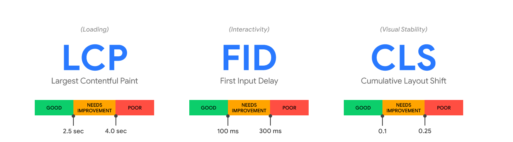
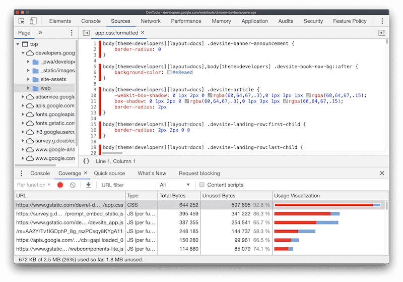

## Web Vitals

Optimizing for quality of user experience is key to the long-term success of any site on the web. Whether you're a business owner, marketer, or developer, Web Vitals can help you quantify the experience of your site and identify opportunities to improve.
Overview #

Web Vitals is an initiative by Google to provide unified guidance for quality signals that are essential to delivering a great user experience on the web.

Google has provided a number of tools over the years to measure and report on performance. Some developers are experts at using these tools, while others have found the abundance of both tools and metrics challenging to keep up with.

Site owners should not have to be performance gurus in order to understand the quality of experience they are delivering to their users. The Web Vitals initiative aims to simplify the landscape, and help sites focus on the metrics that matter most, the Core Web Vitals.
Core Web Vitals #

Core Web Vitals are the subset of Web Vitals that apply to all web pages, should be measured by all site owners, and will be surfaced across all Google tools. Each of the Core Web Vitals represents a distinct facet of the user experience, is measurable in the field, and reflects the real-world experience of a critical user-centric outcome.

The metrics that make up Core Web Vitals will evolve over time. The current set for 2020 focuses on three aspects of the user experience—loading, interactivity, and visual stability—and includes the following metrics (and their respective thresholds):

- Largest Contentful Paint (LCP): measures loading performance. To provide a good user experience, LCP should occur within 2.5 seconds of when the page first starts loading.
- First Input Delay (FID): measures interactivity. To provide a good user experience, pages should have a FID of less than 100 milliseconds.
- Cumulative Layout Shift (CLS): measures visual stability. To provide a good user experience, pages should maintain a CLS of less than 0.1.

For each of the above metrics, to ensure you're hitting the recommended target for most of your users, a good threshold to measure is the 75th percentile of page loads, segmented across mobile and desktop devices.

Tools that assess Core Web Vitals compliance should consider a page passing if it meets the recommended targets at the 75th percentile for all of the above three metrics.
Tools to measure and report Core Web Vitals #

Google believes that the Core Web Vitals are critical to all web experiences. As a result, it is committed to surfacing these metrics in all of its popular tools. The following sections details which tools support the Core Web Vitals.
Field tools to measure Core Web Vitals #

The Chrome User Experience Report collects anonymized, real user measurement data for each Core Web Vital. This data enables site owners to quickly assess their performance without requiring them to manually instrument analytics on their pages, and powers tools like PageSpeed Insights, and Search Console's Core Web Vitals report.
                                	        
<pre>
                                            LCP 	    FID 	CLS
Chrome User Experience Report   	        ✔ 	       ✔ 	    ✔
PageSpeed Insights 	                        ✔ 	       ✔ 	    ✔
Search Console (Core Web Vitals report) 	✔              ✔            ✔
</pre>

The data provided by Chrome User Experience Report offers a quick way to assess the performance of sites, but it does not provide the detailed, per-pageview telemetry that is often necessary to accurately diagnose, monitor, and quickly react to regressions. As a result, we strongly recommend that sites set up their own real-user monitoring.
Measure Core Web Vitals in JavaScript #

Each of the Core Web Vitals can be measured in JavaScript using standard web APIs.

The easiest way to measure all the Core Web Vitals is to use the web-vitals JavaScript library, a small, production-ready wrapper around the underlying web APIs that measures each metric in a way that accurately matches how they're reported by all the Google tools listed above.

With the web-vitals library, measuring each metric is as simple as calling a single function (see the documentation for complete usage and API details):

a result, we strongly recommend that sites set up their own real-user monitoring.
Measure Core Web Vitals in JavaScript #

Each of the Core Web Vitals can be measured in JavaScript using standard web APIs.

The easiest way to measure all the Core Web Vitals is to use the web-vitals JavaScript library, a small, production-ready wrapper around the underlying web APIs that measures each metric in a way that accurately matches how they're reported by all the Google tools listed above.

With the web-vitals library, measuring each metric is as simple as calling a single function (see the documentation for complete usage and API details):
<pre>
import {getCLS, getFID, getLCP} from 'web-vitals';

function sendToAnalytics(metric) {
  const body = JSON.stringify(metric);
  // Use `navigator.sendBeacon()` if available, falling back to `fetch()`.
  (navigator.sendBeacon && navigator.sendBeacon('/analytics', body)) ||
      fetch('/analytics', {body, method: 'POST', keepalive: true});
}

getCLS(sendToAnalytics);
getFID(sendToAnalytics);
getLCP(sendToAnalytics);
</pre>
You can also report on each of the Core Web Vitals without writing any code using the Web Vitals Chrome Extension. This extension uses the web-vitals library to measure each of these metrics and display them to users as they browse the web.

This extension can be helpful in understanding the performance of your own sites, your competitor's sites, and the web at large.
  	LCP 	FID 	CLS
web-vitals 	✔ 	✔ 	✔
Web Vitals Extension 	✔ 	✔ 	✔

* Recommendations for improving your scores #

Once you've measured the Core Web Vitals and identified areas for improvement, the next step is to optimize. The following guides offer specific recommendations for how to optimize your pages for each of the Core Web Vitals:

*   Optimize LCP
    -  I can't see any useful content! Why does it take so long to load? 😖

    - One factor contributing to a poor user experience is how long it takes a user to see any content rendered to the screen. First Contentful Paint (FCP) measures how long it takes for initial DOM content to render, but it does not capture how long it took the largest (usually more meaningful) content on the page to render.

    - Largest Contentful Paint (LCP) is a Core Web Vitals metric and measures when the largest content element in the viewport becomes visible. It can be used to determine when the main content of the page has finished rendering on the screen.

    - The most common causes of a poor LCP are:

        - Slow server response times
        - Render-blocking JavaScript and CSS
        - Slow resource load times
        - Client-side rendering

        Slow server response times #

        The longer it takes a browser to receive content from the server, the longer it takes to render anything on the screen. A faster server response time directly improves every single page-load metric, including LCP.

        Before anything else, improve how and where your server handles your content. Use Time to First Byte (TTFB) to measure your server response times. You can improve your TTFB in a number of different ways:

            Optimize your server
            Route users to a nearby CDN
            Cache assets
            Serve HTML pages cache-first
            Establish third-party connections early

        Optimize your server #

        Are you running expensive queries that take your server a significant amount of time to complete? Or are there other complex operations happening server-side that delay the process to return page content? Analyzing and improving the efficiency of your server-side code will directly improve the time it takes for the browser to receive the data.

        Instead of just immediately serving a static page on a browser request, many server-side web frameworks need to create the web page dynamically. In other words, rather than just sending a complete HTML file that's already ready when the browser requests it, the frameworks need to run logic to construct the page. This could be due to pending results from a database query or even because components need to be generated into markup by a UI framework (such as React). Many web frameworks that run on the server have performance guidance that you can use to speed up this process.

        Route users to a nearby CDN #

A Content Delivery Network (CDN) is a network of servers distributed in many different locations. If the content on your web page is being hosted on a single server, your website will load slower for users that are geographically farther away because their browser requests literally have to travel around the world. Consider using a CDN to ensure that your users never have to wait for network requests to faraway servers.
Cache assets #

If your HTML is static and doesn't need to change on every request, caching can prevent it from being recreated unnecessarily. By storing a copy of the generated HTML on disk, server-side caching can reduce TTFB and minimize resource usage.

Depending on your toolchain, there are many different ways to apply server caching:

    Configure reverse proxies (Varnish, nginx) to serve cached content or act as a cache server when installed in front of an application server
    Configure and manage your cloud provider's (Firebase, AWS, Azure) cache behavior
    Use a CDN that provides edge servers so that your content is cached and stored closer to your users

Serve HTML pages cache-first #

When installed, a service worker runs in the browser background and can intercept requests from the server. This level of programmatic cache control makes it possible to cache some or all of the HTML page's content and only update the cache when the content has changed.

Establish third-party connections early #

Server requests to third-party origins can also impact LCP, especially if they're needed to display critical content on the page. Use rel="preconnect" to inform the browser that your page intends to establish a connection as soon as possible.

<link rel="preconnect" href="https://example.com">

You can also use dns-prefetch to resolve DNS lookups faster.

<link rel="dns-prefetch" href="https://example.com">

Although both hints work differently, consider using dns-prefetch as a fallback for browsers that do not support preconnect.

<head>
  …
  <link rel="preconnect" href="https://example.com">
  <link rel="dns-prefetch" href="https://example.com">
</head>

* Render blocking JavaScript and CSS #
 
Scripts and stylesheets are both render blocking resources which delay FCP, and consequently LCP. Defer any non-critical JavaScript and CSS to speed up loading of the main content of your web page.
Reduce CSS blocking time #

Ensure that only the minimal amount of necessary CSS is blocking render on your site with the following:

    Minify CSS
    Defer non-critical CSS
    Inline critical CSS

* Minify CSS #

    For easier legibility, CSS files can contain characters such as spacing, indentation, or comments. These characters are all unnecessary for the browser, and minifying these files will ensure that they get removed. Ultimately, reducing the amount of blocking CSS will always improve the time it takes to fully render the main content of the page (LCP).

    If you use a module bundler or build tool, include an appropriate plugin to minify CSS files on every build:

        For webpack: optimize-css-assets-webpack-plugin
        For Gulp: gulp-clean-css
        For Rollup: rollup-plugin-css-porter

* Defer non-critical CSS #

    Use the Coverage tab in Chrome DevTools to find any unused CSS on your web page.

        

    Inline critical CSS #

    Inline any critical-path CSS used for above-the-fold content by including it directly in <head>.
        

    Inlining important styles eliminates the need to make a round-trip request to fetch critical CSS. Deferring the rest minimizes CSS blocking time.

    If you cannot manually add inline styles to your site, use a library to automate the process. Some examples:

    - Critical, CriticalCSS, and Penthouse are all packages that extract and inline above-the-fold CSS

    - Critters is a webpack plugin that inlines critical CSS and lazy-loads the rest

* Reduce JavaScript blocking time #

    Download and serve the minimal amount of necessary JavaScript to users. Reducing the amount of blocking JavaScript results in a faster render, and consequently a better LCP.

    This can be accomplished by optimizing your scripts in a few different ways:

    - Minify and compress JavaScript files
    - Defer unused JavaScript
    - Minimize unused polyfills

* Slow resource load times #

    Although an increase in CSS or JavaScript blocking time will directly result in worse performance, the time it takes to load many other types of resources can also affect paint times. The types of elements that affect LCP are:

    -  elements
    - <image> elements inside an <svg> element
    - <video> elements (if specified, the poster image is used to measure LCP)
    - An element with a background image loaded via the url() function (as opposed to a CSS gradient)
    - Block-level elements containing text nodes or other inline-level text elements

    The time it takes to load these elements if rendered above-the-fold will have a direct effect on LCP. There are a few ways to ensure these files are loaded as fast as possible:

    - Optimize and compress images
    - Preload important resources
    - Compress text files
    - Deliver different assets based on network connection (adaptive serving)
    - Cache assets using a service worker

* Optimize and compress images #

    For many sites, images are the largest element in view when the page has finished loading. Hero images, large carousels or banner images are all common examples of this.

    Improving how long it takes to load and render these types of images will directly speed up LCP. To do this:

    - Consider not using an image in the first place. If it's not relevant to the content, remove it.
    - Compress images (with Imagemin for example)
    - Convert images into newer formats (JPEG 2000, JPEG XR, or WebP)
    - Use responsive images
    - Consider using an image CDN

* Preload important resources #

    At times, important resources that are declared or used in a certain CSS or JavaScript file may be fetched later than you would like, such as a font tucked deep in one of the many CSS files of an application.

    If you know that a particular resource should be prioritized, use <link rel="preload"> to fetch it sooner. Many types of resources can be preloaded, but you should first focus on preloading critical assets, such as fonts, above-the-fold images or videos, and critical-path CSS or JavaScript.

    <link rel="preload" as="script" href="script.js">
    <link rel="preload" as="style" href="style.css">
    <link rel="preload" as="image" href="img.png">
    <link rel="preload" as="video" href="vid.webm" type="video/webm">
    <link rel="preload" href="font.woff2" as="font" type="font/woff2" crossorigin>

    Since Chrome 73, preloading can be used along with responsive images to combine both patterns for much faster image loading.

    <link
    rel="preload"
    as="image"
    href="wolf.jpg"
    imagesrcset="wolf_400px.jpg 400w, wolf_800px.jpg 800w, wolf_1600px.jpg 1600w"
    imagesizes="50vw"
    >

* Compress text files #

    Compression algorithms, like Gzip and Brotli, can significantly reduce the size of text files (HTML, CSS, JavaScript) as they're transferred between the server and browser. Gzip is effectively supported in all browsers and Brotli, which provides even better compression results, can be used in almost all newer browsers.

    Compressing your resources will minimize their delivery size, improving load times and consequently LCP.

    - First, check if your server already compresses files automatically. Most hosting platforms, CDNs, and reverse proxy servers either encode assets with compression by default or allow you to easily configure them.
    -If you need to modify your server to compress files, consider using Brotli instead of gzip since it can provide better compression ratios.
    - Once you pick a compression algorithm to use, compress assets ahead of time during the build process instead of on-the-fly as they are requested by the browser. This - - - minimizes server overhead and prevents delays when requests are made, especially when using high compression ratios   

* Adaptive serving #

    When loading resources that make up the main content of a page, it can be effective to conditionally fetch different assets depending on the user's device or network conditions. This can be done using the Network Information, Device Memory, and HardwareConcurrency APIs.

    If you have large assets that are critical for initial rendering, you can use different variations of the same resource depending on the user's connection or device. For example, you can display an image instead of a video for any connection speeds lower than 4G:

    if (navigator.connection && navigator.connection.effectiveType) {
    if (navigator.connection.effectiveType === '4g') {
        // Load video
    } else {
        // Load image
    }
    }
    A list of useful properties that you can use:

    - navigator.connection.effectiveType: Effective connection type
    - navigator.connection.saveData: Data-saver enabled/disabled
    - navigator.hardwareConcurrency: CPU core count
    - navigator.deviceMemory: Device Memory

* Cache assets using a service worker #

    Service workers can be used for many useful tasks, including serving smaller HTML responses as mentioned earlier in this article. They can also be used to cache any static resource which can be served to the browser instead of from the network on repeat requests.

    Precaching critical resources using a service worker can reduce their load times significantly, especially for users who reload the web page with a weaker connection (or even access it offline). Libraries like Workbox can make the process of updating precached assets easier than writing a custom service worker to handle this yourself.

* Client-side rendering #

    Many sites use client-side JavaScript logic to render pages directly in the browser. Frameworks and libraries, like React, Angular, and Vue, have made it easier to build single-page applications that handle different facets of a web page entirely on the client rather on the server.

    If you're building a site that is mostly rendered on the client, you should be wary of the effect it can have on LCP if a large JavaScript bundle is used. If optimizations aren't in place to prevent it, users may not see or interact with any content on the page until all the critical JavaScript has finished downloading and executing.

    When building a client-side rendered site, consider the following optimizations:

        Minimize critical JavaScript
        Use server-side rendering
        Use pre-rendering

* Minimize critical JavaScript #

    If content on your site only becomes visible, or can be interacted with, after a certain amount of JavaScript is downloaded: it becomes even more important to cut down on the size of your bundle as much as possible. This can be done by:

        Minifying JavaScript
        Deferring unused JavaScript
        Minimizing unused polyfills

    Go back to the Reduce JavaScript blocking time section to read more about these optimizations.
    Use server-side rendering #

    Minimizing the amount of JavaScript should always be the first thing to focus on for sites that are mostly client-rendered. However, you should also consider combining a server rendering experience to improve LCP as much as possible.

    This concept works by using the server to render the application into HTML, where the client then "hydrates" all the JavaScript and required data onto the same DOM content. This can improve LCP by ensuring the main content of the page is first rendered on the server rather than only on the client, but there are a few drawbacks:

        Maintaining the same JavaScript-rendered application on the server and the client can increase complexity.
        Executing JavaScript to render an HTML file on the server will always increase server response times (TTFB) as compared to just serving static pages from the server.
        A server-rendered page may look like it can be interacted with, but it can't respond to any user input until all the client-side JavaScript has executed. In short, it can make Time to Interactive (TTI) worse.

* Use pre-rendering #

    Pre-rendering is a separate technique that is less complex than server-side rendering and also provides a way to improve LCP in your application. A headless browser, which is a browser without a user interface, is used to generate static HTML files of every route during build time. These files can then be shipped along with the JavaScript bundles that are needed for the application.

    With pre-rendering, TTI is still negatively impacted but server response times aren't as affected as they would be with a server-side rendering solution that dynamically renders each page only after it's requested.

*   Optimize First Input Delay

First Contentful Paint (FCP) and Largest Contentful Paint (LCP) are both metrics that measure the time it takes for content to visually render (paint) on a page. Although important, paint times do not capture load responsiveness: or how quickly a page responds to user interaction.

First Input Delay (FID) is a Core Web Vitals metric that captures a user's first impression of a site's interactivity and responsiveness. It measures the time from when a user first interacts with a page to the time when the browser is actually able to respond to that interaction. FID is a field metric and cannot be simulated in a lab environment. A real user interaction is required in order to measure the response delay.
Good FID scores are 2.5 seconds, poor scores are greater than 4.0 seconds and anything in between needs improvement.

To help predict FID in the lab, we recommend Total Blocking Time (TBT). They measure different things, but improvements in TBT usually correspond to improvements in FID.

The main cause of a poor FID is heavy JavaScript execution. Optimizing how JavaScript parses, compiles, and executes on your web page will directly reduce FID.
Heavy JavaScript execution #

The browser cannot respond to most user input while it's executing JavaScript on the main thread. In other words, the browser can't respond to user interactions while the main thread is busy. To improve this:

    Break up Long Tasks
    Optimize your page for interaction readiness
    Use a web worker
    Reduce JavaScript execution time

Break up Long Tasks #

If you've already attempted to reduce the amount of JavaScript that loads on a single page, it can be useful to break down long-running code into smaller, asynchronous tasks.

Long Tasks are JavaScript execution periods where users may find your UI unresponsive. Any piece of code that blocks the main thread for 50 ms or more can be characterized as a Long Task. Long Tasks are a sign of potential JavaScript bloat (loading and executing more than a user may need right now).
Splitting up long tasks can reduce input delay on your site.

FID should improve noticeably as you adopt best practices like code-splitting and breaking up your Long Tasks. While TBT is not a field metric, it's useful for checking progress towards ultimately improving both Time To Interactive (TTI) and FID.

Optimize your page for interaction readiness #

There are a number of common causes for poor FID and TBT scores in web apps that rely heavily on JavaScript:
First-party script execution can delay interaction readiness #

    - JavaScript size bloat, heavy execution times and inefficient chunking can slow down how soon a page can respond to user input and impact FID, TBT, and TTI. Progressive loading of code and features can help spread this work out and improve interaction readiness.
    - Server-side rendered apps may look like they're getting pixels painted on the screen quickly, but beware of user interactions being blocked by large script executions (e.g. re-hydration to wire up event listeners). This can take several hundred milliseconds, sometimes even seconds, if route-based code splitting is being used. Consider shifting more logic server-side or generating more content statically during build time.

Below are the TBT scores before and after optimizing first-party script loading for an application. By moving costly script loading (and execution) for a non-essential component off the critical path, users were able to interact with the page much sooner.

Data-fetching can impact many aspects of interaction readiness #

    Waiting on a waterfall of cascading fetches (e.g. JavaScript and data fetches for components) can impact interaction latency. Aim to minimize a reliance on cascading data fetches.
    Large inline datastores can push out HTML parsing time and impact both paint and interaction metrics. Aim to minimize how much data needs to be post-processed on the client-side.

Third-party script execution can delay interaction latency too #

    Many sites include third-party tags and analytics which can keep the network busy and make the main thread periodically unresponsive, impacting interaction latency. Explore on-demand loading of third-party code (e.g. maybe don't load those below-the-fold ads until they're scrolled closer to the viewport).
    In some cases, third-party scripts can pre-empt first-party ones in terms of priority and bandwidth on the main thread, also delaying how soon a page is interaction-ready. Attempt to prioritize loading what you believe offers the greatest value to users first.

Use a web worker #

A blocked main thread is one of the main causes of input delay. Web workers make it possible to run JavaScript on a background thread. Moving non-UI operations to a separate worker thread can cut down main thread blocking time and consequently improve FID.

Consider using the following libraries to make it easier to use web workers on your site:

    Comlink: A helper library that abstracts postMessage and makes it easier to use
    Workway: A general purpose web worker exporter
    Workerize: Move a module into a web worker

Reduce JavaScript execution time #

Limiting the amount of JavaScript on your page reduces the amount of time that the browser needs to spend executing JavaScript code. This speeds up how fast the browser can begin to respond to any user interactions.

To reduce the amount of JavaScript executed on your page:

    Defer unused JavaScript
    Minimize unused polyfills

Defer unused JavaScript #

By default all JavaScript is render-blocking. When the browser encounters a script tag that links to an external JavaScript file, it must pause what it's doing and download, parse, compile, and execute that JavaScript. Therefore you should only load the code that's needed for the page or responding to user input.

The Coverage tab in Chrome DevTools can tell you how much JavaScript is not being used on your web page.

To cut down on unused JavaScript:

    Code-split your bundle into multiple chunks
    Defer any non-critical JavaScript, including third-party scripts, using async or defer

Code-splitting is the concept of splitting a single large JavaScript bundle into smaller chunks that can be conditionally loaded (also known as lazy-loading). Most newer browsers support dynamic import syntax, which allows for module fetching on demand:

import('module.js')	
  .then((module) => {	
    // Do something with the module.	
  });	

Dynamically importing JavaScript on certain user interactions (such as changing a route or displaying a modal) will make sure that code not used for the initial page load is only fetched when needed.

Aside from general browser support, dynamic import syntax can be used in many different build systems.

    If you use webpack, Rollup, or Parcel as a module bundler, take advantage of their dynamic import support.
    Client-side frameworks, like React, Angular, and Vue provide abstractions to make it easier to lazy-load at the component-level.

How to respond faster to user interactions. 

*   Optimize Cumulative Layout Shift

"I was about to click that! Why did it move? 😭"

Layout shifts can be distracting to users. Imagine you've started reading an article when all of a sudden elements shift around the page, throwing you off and requiring you to find your place again. This is very common on the web, including when reading the news, or trying to click those 'Search' or 'Add to Cart' buttons. Such experiences are visually jarring and frustrating. They're often caused when visible elements are forced to move because another element was suddenly added to the page or resized.

Cumulative Layout Shift (CLS) - a Core Web Vitals metric, measures the instability of content by summing shift scores across layout shifts that don't occur within 500ms of user input. It looks at how much visible content shifted in the viewport as well as the distance the elements impacted were shifted.

In this guide, we'll cover optimizing common causes of layout shifts.
Good CLS values are under 0.1, poor values are greater than 0.25 and anything in between needs improvement

The most common causes of a poor CLS are:

    Images without dimensions
    Ads, embeds, and iframes without dimensions
    Dynamically injected content
    Web Fonts causing FOIT/FOUT
    Actions waiting for a network response before updating DOM

Images without dimensions 🌆 #

Summary: Always include width and height size attributes on your images and video elements. Alternatively, reserve the required space with CSS aspect ratio boxes. This approach ensures that the browser can allocate the correct amount of space in the document while the image is loading.

History #

In the early days of the web, developers would add width and height attributes to their  tags to ensure sufficient space was allocated on the page before the browser started fetching images. This would minimize reflow and re-layout.

You may notice width and height above do not include units. These "pixel" dimensions would ensure a 640x360 area would be reserved. The image would stretch to fit this space, regardless of whether the true dimensions matched or not.

When Responsive Web Design was introduced, developers began to omit width and height and started using CSS to resize images instead:

img {
  width: 100%; /* or max-width: 100%; */
  height: auto;
}

A downside to this approach is space could only be allocated for an image once it began to download and the browser could determine its dimensions. As images loaded in, the page would reflow as each image appeared on screen. It became common for text to suddenly pop down the screen. This wasn't a great user experience at all.

This is where aspect ratio comes in. The aspect ratio of an image is the ratio of its width to its height. It's common to see this expressed as two numbers separated by a colon (for example 16:9 or 4:3). For an x:y aspect ratio, the image is x units wide and y units high.

This means if we know one of the dimensions, the other can be determined. For a 16:9 aspect ratio:

    If puppy.jpg has a 360px height, width is 360 x (16 / 9) = 640px
    If puppy.jpg has a 640px width, height is 640 x (9 / 16) = 360px

Knowing the aspect ratio allows the browser to calculate and reserve sufficient space for the height and associated area.
Modern best practice #

Modern browsers now set the default aspect ratio of images based on an image's width and height attributes so it's valuable to set them to prevent layout shifts. Thanks to the CSS Working Group, developers just need to set width and height as normal:

<!-- set a 640:360 i.e a 16:9 - aspect ratio -->

…and the UA stylesheets of all browsers add a default aspect ratio based on the element's existing width and height attributes:

img {
    aspect-ratio: attr(width) / attr(height);
}

This calculates an aspect ratio based on the width and height attributes before the image has loaded. It provides this information at the very start of layout calculation. As soon as an image is told to be a certain width (for example width: 100%), the aspect ratio is used to calculate the height.

Tip: If you're having a hard time understanding aspect ratio, a handy calculator is available to help.

The above image aspect ratio changes have shipped in Firefox and Chromium, and are coming to WebKit (Safari).

For a fantastic deep-dive into aspect ratio with further thinking around responsive images, see jank-free page loading with media aspect ratios.

If your image is in a container, you can use CSS to resize the image to the width of this container. We set height: auto; to avoid the image height being a fixed value (for example 360px).

img {
  height: auto;
  width: 100%;
}

What about responsive images?

When working with responsive images, srcset defines the images you allow the browser to select between and what size each image is. To ensure  width and height attributes can be set, each image should use the same aspect ratio.

What about art direction?

Pages may wish to include a cropped shot of an image on narrow viewports with the full image displayed on desktop.

<picture>
  <source media="(max-width: 799px)" srcset="puppy-480w-cropped.jpg">
  <source media="(min-width: 800px)" srcset="puppy-800w.jpg">
  
</picture>

It's very possible these images could have different aspect ratios and browsers are still evaluating what the most efficient solution here should be, including if dimensions should be specified on all sources. Until a solution is decided on, relayout is still possible here.
Ads, embeds and iframes without dimensions 📢😱 #
Advertisements #

Ads are one of the largest contributors to layout shifts on the web. Ad networks and publishers often support dynamic ad sizes. Ad sizes increase performance/revenue due to higher click rates and more ads competing in the auction. Unfortunately, this can lead to a suboptimal user experience due to ads pushing visible content you're viewing down the page.

During the ad lifecycle, many points can introduce layout shift:

    When a site inserts the ad container in the DOM
    When a site resizes the ad container with first-party code
    When the ad tag library loads (and resizes the ad container)
    When the ad fills a container (and resizes if the final ad has a different size)

The good news is that it's possible for sites to follow best practices to reduce ad shift. Sites can mitigate these layout shifts by:

    Statically reserve space for the ad slot.
        In other words, style the element before the ad tag library loads.
        If placing ads in the content flow, ensure shifts are eliminated by reserving the slot size. These ads shouldn't cause layout shifts if loaded off-screen.
    Take care when placing non-sticky ads near the top of the viewport.
        In the below example, it's recommended to move the ad to below the "world vision" logo and make sure to reserve enough space for the slot.
    Avoid collapsing the reserved space if there is no ad returned when the ad slot is visible by showing a placeholder.
    Eliminate shifts by reserving the largest possible size for the ad slot.
        This works, but it risks having a blank space if a smaller ad creative fills the slot.
    Choose the most likely size for the ad slot based on historical data.

Some sites may find collapsing the slot initially can reduce layout shifts if the ad slot is unlikely to fill. There isn't an easy way to choose the exact size each time, unless you control the ad serving yourself.

Refer https://web.dev/vitals/