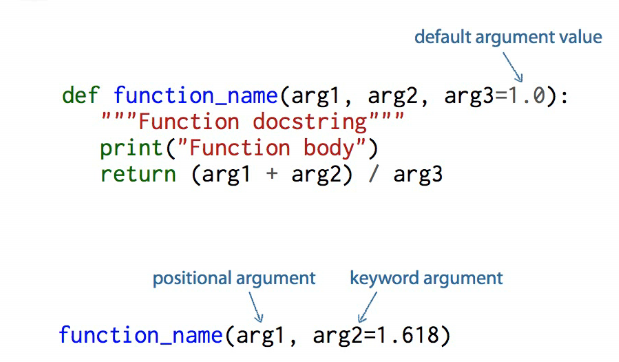
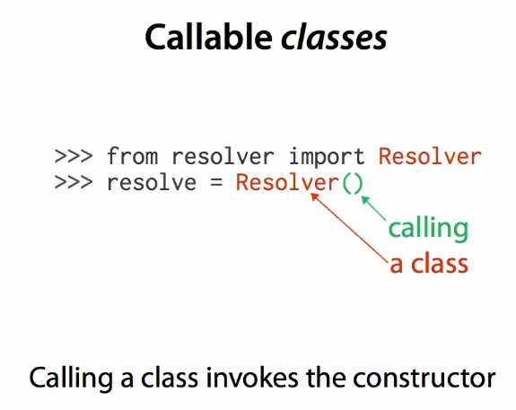
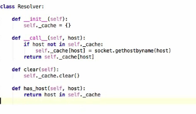
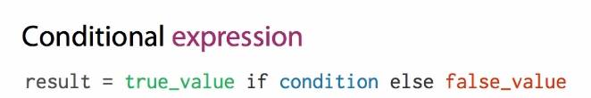
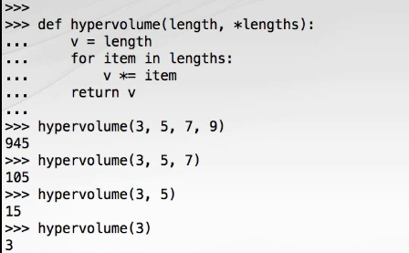
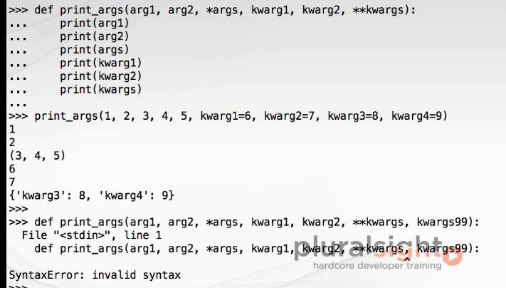
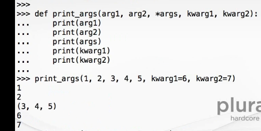
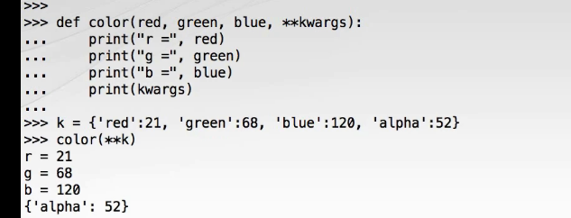
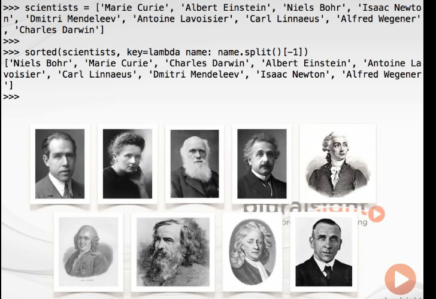
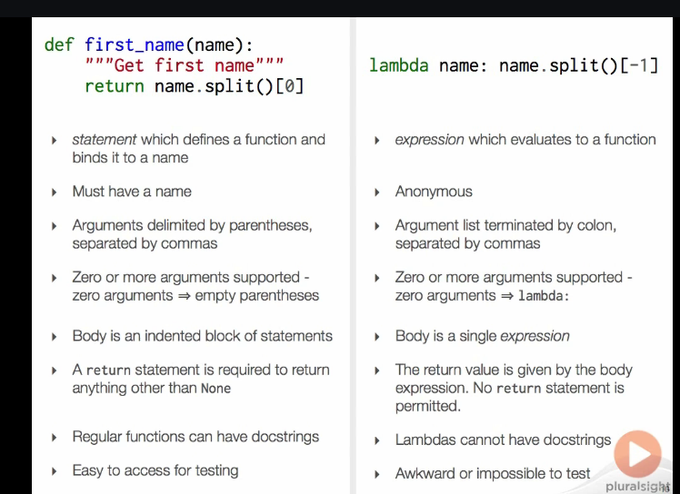

# Beyound the basics

### Project structue

   *  __init__.py labels a directory as a python directory and lets you set variables on a package wide level.

   * __main__.py is run if you try to run a compressed group of python files. __main__.py allows you to execute packages.

   * Modules should be singleton
        * Modules are executed only once, when first imported
        * Module initialization order is well defined 

### Basic Functions

   * 

   * Methods can be overridden in subclasses
   * functions are first class -  can be passed as an object
   
   *  __call__ in Python

         *  The __call__ method enables Python programmers to write classes where the instances behave like functions and can be called like a function. When the instance is called as a function; if this method is defined, x(arg1, arg2, ...) is a shorthand for x.__call__(arg1, arg2, ...).
   * 

   * 

      * object() is shorthand for object.__call__()
      *  class Product: 

            def __init__(self): 
               print("Instance Created") 
            // Defining __call__ method 
            def __call__(self, a, b): 
               print(a * b) 
          //Instance created 
         ans = Product() 
          //__call__ method will be called 
         ans(10, 20) 
     * Output :
           Instance Created
           200

   #### Conditional expression
   
   

   #### varargs

   

   
   
   
   
   

   #### lambda functions

   

   

      * Using Lambda : Lambda definition does not include a “return” statement, it always contains an expression which is returned. We can also put a lambda definition anywhere a function is expected, and we don’t have to assign it to a variable at all. This is the simplicity of lambda functions.
      * A lambda function is a small anonymous function.

         * lambda function can take any number of arguments, but can only have one expression.
         Syntax
         lambda arguments : expression 

      * Few examples

            <pre>lambda func</pre>
                     // # Python code to illustrate 
                     // # filter() with lambda() 
                     li = [5, 7, 22, 97, 54, 62, 77, 23, 73, 61] 
                     final_list = list(filter(lambda x: (x%2 != 0) , li)) 
                     print(final_list) 

                     // # Python code to illustrate 
                     // # map() with lambda() 
                     // # to get double of a list. 
                     li = [5, 7, 22, 97, 54, 62, 77, 23, 73, 61] 
                     final_list = list(map(lambda x: x*2 , li)) 
                     print(final_list) 

                     // Python code to illustrate 
                     // reduce() with lambda() 
                     // to get sum of a list 
                     from functools import reduce
                     li = [5, 8, 10, 20, 50, 100] 
                     sum = reduce((lambda x, y: x + y), li) 
                     print (sum) 

      * Example showing diff between normal def and lambda function

                  //# Python code to illustrate cube of a number 
                  //# showing difference between def() and lambda(). 
                  def cube(y): 
                     return y*y*y; 

                  g = lambda x: x*x*x 
                  print(g(7)) 

                  print(cube(5)) 

