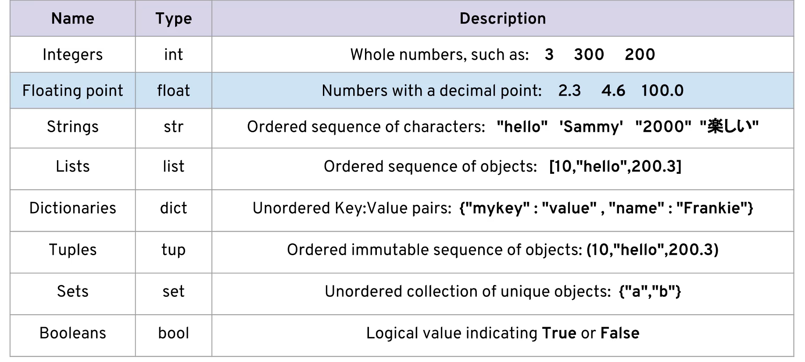
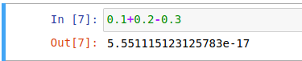
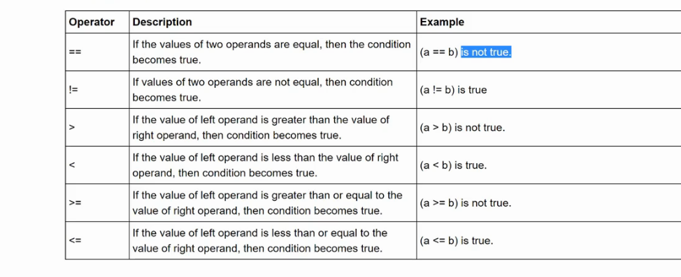

## Basics

   #### Datatypes

   - Python 3
   - 
   - Why doesn't 0.1+0.2-0.3 equal 0.0 ?

        - This has to do with floating point accuracy and computer's abilities to represent numbers in memory
        
  
    - Remember, Python 3 performs true division by default!
       1/2  ==> 0.5   

    Assignment
        
- It is considered best practices (PEP8) that names are lowercase. Constant can
        be declarred as uppercase
- Dynamic Typing - This means that you can reassign variables to different data types
  * my_cat = 4
  * my_cat = 'Saraswati'
  * Pros
      * Very easy to work with
      * Faster development time
  * Cons
      * May result in bugs for unexpected data types!
      * You need to be aware of type() -

- Strings are ordered sequences so we can use indexing and slicing to grab sub sections
    * Charecter A  d  i  t  i
    * Index   ----   0  1  2  3  4
    * Reverse - 0 -4  -3 -2 -1

  - Slicing
    - [start:stop:step]
    - 'Saraswati'[0:5:1] ==> 'Saras'
    * Immutability 
      * name = 'Saraswati'
      * name[0] = 'N' // Error Strings are immutable in Python
      * 'N' + name[1:] // one of the correct way of doing concatenation
  - String methods
      * capitalize() -Converts the first character to upper case
      *  casefold() -	Converts string into lower case
      *  center() -	Returns a centered string
      *  count() -	Returns the number of times a specified value occurs in a string
      *  encode() -	Returns an encoded version of the string
      *  endswith() -	Returns true if the string ends with the specified value
      *  expandtabs() -	Sets the tab size of the string
      *  find() -	Searches the string for a specified value and returns the position of where it was found
      *  format() -	Formats specified values in a string
      *  format_map() -	Formats specified values in a string
      *  index() -	Searches the string for a specified value and returns the position of where            *  it was found
      *  isalnum() -	Returns True if all characters in the string are alphanumeric
      *  isalpha() -	Returns True if all characters in the string are in the alphabet
      *  isdecimal() -	Returns True if all characters in the string are decimals
      *  isdigit() -	Returns True if all characters in the string are digits
      *  isidentifier() -	Returns True if the string is an identifier
      *  islower() -	Returns True if all characters in the string are lower case
      *  isnumeric() -	Returns True if all characters in the string are numeric
      *  isprintable() -	Returns True if all characters in the string are printable
      *  isspace() -	Returns True if all characters in the string are whitespaces
      *  istitle() - 	Returns True if the string follows the rules of a title
      *  isupper() -	Returns True if all characters in the string are upper case
      *  join() -	Joins the elements of an iterable to the end of the string
      *  ljust() -	Returns a left justified version of the string
      *  lower() -	Converts a string into lower case
      *  lstrip() -	Returns a left trim version of the string
      *  maketrans() -	Returns a translation table to be used in translations
      *  partition() -	Returns a tuple where the string is parted into three parts
      *  replace() -	Returns a string where a specified value is replaced with a specified            *  value
      *  rfind() -	Searches the string for a specified value and returns the last position of where it was found
      *  rindex() -	Searches the string for a specified value and returns the last position of where it was found
      *  rjust() -	Returns a right justified version of the string
      *  rpartition() -	Returns a tuple where the string is parted into three parts
      *  rsplit() -	Splits the string at the specified separator, and returns a list
      *  rstrip() -	Returns a right trim version of the string
      *  split() -	Splits the string at the specified separator, and returns a list
      *  splitlines() -	Splits the string at line breaks and returns a list
      *  startswith() -	Returns true if the string starts with the specified value
      *  strip() -	Returns a trimmed version of the string
      *  swapcase() -	Swaps cases, lower case becomes upper case and vice versa
      *  title() -	Converts the first character of each word to upper case
      *  translate() -	Returns a translated string
      *  upper() -	Converts a string into upper case
      *  zfill() - Fills the string with a specified number of 0 values at the beginning
  - Format Strings:
    - .format {value:width:precision}
    - .format
      - print('Saraswati is a {} person'.format('trustable'))
      - print('Saraswati is a {1} and {0} person'.format('opportunistic', 'envious')) #Mind the indexing
      - print('Saraswati is a {l} and {f} person'.format(f='opportunistic', l='envious')) #Mind the indexing
      - print(f'Saraswati is a {virtual} person') # Virtual will be evaluated at this line| format string feature
- List
  - Reverse indexing, slicing works similar to String
  - List Comprehensions
      * Python has an advanced feature called list comprehensions. They allow for quick construction of lists. To fully understand list comprehensions we need to understand for loops.
        *  Build a list comprehension by deconstructing a for loop within a []
      * first_col = [row[0] for row in matrix]
- Dictionaories
  - You can think of Dictionaries as hash tables.A Python dictionary consists of a key and then an associated value. That value can be almost any Python object.
  - Dictionaries are unordered and cannot be sorted
  - Creating Dictionary 
    - my_crush= {}
    - my_crush={'Apple' : 3, 'Mango':30, 'Papaya':0.5}
    - Methods:
      - keys()
      - values()
      - items() - return tuples of all items
- Tuples
  - In Python tuples are very similar to lists, however, unlike lists they are immutable meaning they can not be changed. You would use tuples to present things that shouldn't be changed, such as days of the week, or dates on a calendar.
  - It can't be stressed enough that tuples are immutable.
    - Because of this immutability, tuples can't grow. Once a tuple is made we can not add to it.
  - When to use Tuples
    - You may be wondering, "Why bother using tuples when they have fewer available methods?" To be honest, tuples are not used as often as lists in programming, but are used when immutability is necessary. If in your program you are passing around an object and need to make sure it does not get changed, then a tuple becomes your solution. It provides a convenient source of data integrity.
- Sets
  - Sets are an **unordered** collection of unique elements. We can construct them by using the set() function.
  - x = set()
  - x.add('Bata', 'Liberty', 'Relaxo')
  - x ==> {}
  - Note the curly brackets. This does not indicate a dictionary! Although you can draw analogies as a set being a dictionary with only keys.
  - list1 = [1,1,2,2,3,4,5,6,1,1]
  - set(list1)
  - {1, 2, 3, 4, 5, 6}
- Booleans
  - Python comes with Booleans (with predefined True and False displays that are basically just the integers 1 and 0). It also has a placeholder object called None.

#### Comparison Operators

   - 
   - Parenthesis are not required always

#### Statements
   - <code>
        Version 1 (Other Languages)

      if (a>b){
          a = 2;
          b = 4;
      }

      Version 2 (Python)

      if a>b:
          a = 2
          b = 4
    </code>
  - Note how Python is so heavily driven by code indentation and whitespace. This means that code readability is a core part of the design of the Python language.
  - For loop
    - tup = (1,2,3,4,5)

      for t in tup:
          print(t)
          

   - d = {'k1':1,'k2':2,'k3':3}
      for item in d:
          print(item)
      /* k1
      k2
      k3 */

  - **Dictionary unpacking**
      for k,v in d.items():
          print(k)
          print(v) 

          /*k1
          1
          k2
          2
          k3
          3*/
  - While loop
      - The while statement in Python is one of most general ways to perform iteration. A while statement will repeatedly execute a single statement or group of statements as long as the condition is true. The reason it is called a 'loop' is because the code statements are looped through over and over again until the condition is no longer met.
    - The general format of a while loop is:
    - <code>
        while test:
            code statements
        else:
            final code statements
      </code>
  #### Useful operators
  
  There are a few built-in functions and "operators" in Python that don't fit well into any category, so we will go over them in this lecture, let's begin!

  - range
The range function allows you to quickly generate a list of integers, this comes in handy a lot, so take note of how to use it! There are 3 parameters you can pass, a start, a stop, and a step size. Let's see some examples:

  - range(0,99)
  * Note that this is a generator function, so to actually get a list out of it, we need to cast it to a list with list(). What is a generator? Its a special type of function that will generate information and not need to save it to memory. We haven't talked about functions or generators yet, so just keep this in your notes for now, we will discuss this in much more detail in later on in your training!
  *  Notice how 99 is not included, up to but not including 11, just like slice notation!
  list(range(0,99))
  [0,1,2,3,4,5,6... 98]
  * Third parameter is step size!
   step size just means how big of a jump/leap/step you 
   take from the starting number to get to the next number.
    list(range(0,99,2))
    [0,2,4,6,8.. 98]

- enumerate
  * enumerate is a very useful function to use with for loops. Let's imagine the following situation:

  * for i,letter in enumerate('abcde'):
    print("At index {} the letter is {}".format(i,letter))

- zip
   * Notice the format enumerate actually returns, let's take a look by transforming it to a list()
   * list(enumerate('abcde'))
   * list(enumerate('abcde'))
  [(0, 'a'), (1, 'b'), (2, 'c'), (3, 'd'), (4, 'e')]

  * It was a list of tuples, meaning we could use tuple unpacking during our for loop. This data structure is actually very common in Python , especially when working with outside libraries. You can use the zip() function to quickly create a list of tuples by "zipping" up together two lists.
  * mylist1 = [1,2,3,4,5]
    mylist2 = ['a','b','c','d','e']
   * This one is also a generator! We will explain this later, but for now let's transform it to a list
    zip(mylist1,mylist2)
    
  * list(zip(mylist1,mylist2)) 
    * [(1, 'a'), (2, 'b'), (3, 'c'), (4, 'd'), (5, 'e')]
    * for item1, item2 in zip(mylist1,mylist2):
    print('For this tuple, first item was {} and second item was {}'.format(item1,item2))

- in operator
We've already seen the in keyword durng the for loop, but we can also use it to quickly check if an object is in a list

- min and max
Quickly check the minimum or maximum of a list with these functions.

- random
Python comes with a built in random library. There are a lot of functions included in this random library, so we will only show you two useful functions for now.
  * from random import shuffle
  * This shuffles the list "in-place" meaning it won't return anything, instead it will effect the list passed
  shuffle(mylist)
  mylist
  * [40, 10, 100, 30, 20]
  * from random import randint
    * Return random integer in range [a, b], including both end points.
    randint(0,100)
- input('Enter Something into this box: ')
  
